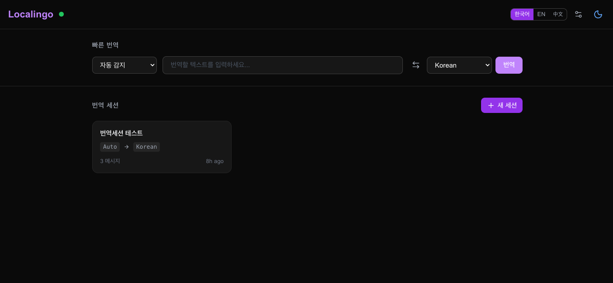
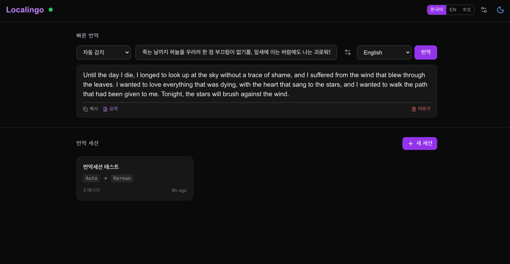
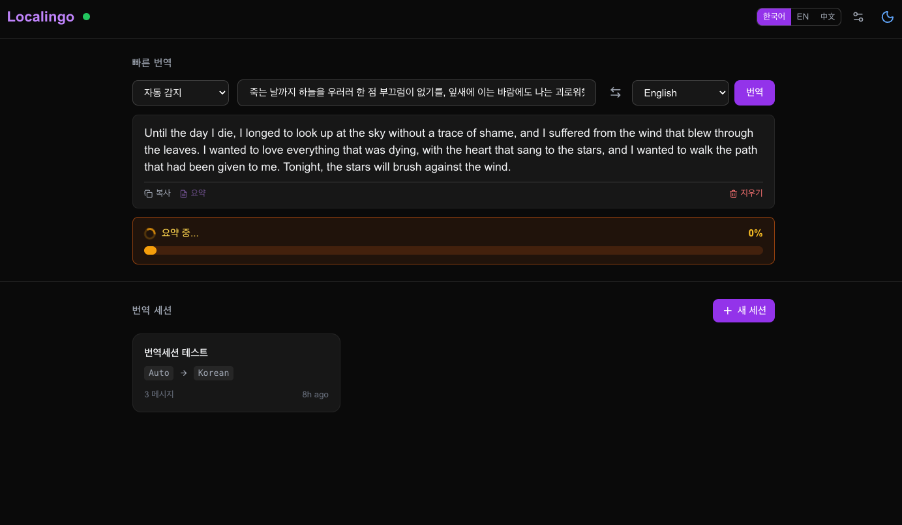
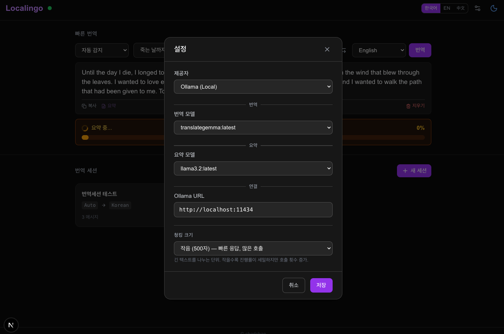
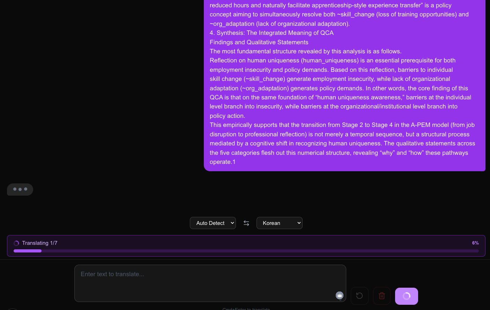

# Localingo

[English](README.md) | [한국어](README_KO.md) | [中文](README_ZH.md)

A local-first translation and summarization tool powered by Ollama. No internet required, zero cost, full privacy.

### Main Page (Dark Mode)


### Quick Translate with Result


### Summarization Progress


### Settings Modal


### Session Chat with Streaming Progress


---

## Why Localingo?

Every time you translate something with Google Translate or DeepL, your data leaves your machine. For researchers handling sensitive interview data, unpublished manuscripts, or confidential documents, this is a problem.

**Localingo runs entirely on your machine.** It uses Ollama's local LLM models — your text never leaves localhost.

---

## Features

### Quick Translate (Instant)

No session needed. Type or paste text, get translation instantly.

- **Auto language detection** — detects source language automatically (langdetect)
- **59 languages** — 7 primary (KO/EN/ZH/JA/ES/FR/DE) + 52 extended
- **Swap button** — flip source ↔ target with one click
- **Copy & Summary** — copy result or summarize with a different model
- **Clear** — reset input and output

### Translation Sessions (Chat-style)

Create named sessions for organized translation work.

- **Chat-style UI** — source text (right bubble) → translation (left bubble)
- **Session management** — create, rename, delete, export as Markdown
- **Session cards** — dashboard with all sessions, message count, last updated
- **Undo / Clear All** — remove last pair or reset entire session
- **Copy / Summary / Clear** — per-message actions on hover

### Real-time Progress Bars

No more staring at a spinner wondering if it's working.

- **Token-level streaming** — Ollama `stream: true` → SSE → progress bar fills token by token
- **Chunk progress** — for long texts, shows "Translating 2/5 chunks — 40%"
- **Translation bar** (purple) + **Summarization bar** (amber) — stacked, each activates independently
- **Direct backend connection** — bypasses Next.js proxy buffering for real-time updates

### Smart Text Chunking

Long texts are automatically split and translated chunk by chunk.

- **Configurable chunk size** — XSmall (100), Small (500), Medium (1,500 default), Large (3,000), XLarge (5,000)
- **Paragraph → sentence splitting** — preserves natural boundaries
- **No input size limit** — any length text, chunked automatically

### Smart Model Management

Prevents GPU memory overflow when switching between translation and summarization models.

- **Auto unload/load** — when a different model is needed, the previous one is freed first
- **Same-model skip** — consecutive same-model calls don't trigger unnecessary reload
- **Memory efficient** — only one model loaded at a time

### LLM Settings

Full control over which models to use.

- **Multi-provider** — Ollama (local), DeepL, Google Translate, OpenAI (DeepL/Google/OpenAI are placeholders for future implementation)
- **Separate translate/summarize models** — e.g., translategemma for translation, qwen3.5 for summary
- **All installed Ollama models available** — 9 models in both dropdowns
- **Chunk size configuration** — in the same settings modal

### UI Language

- **Korean / English / Chinese** — toggle in header
- **Cookie persistence** — remembers your choice
- **Target language follows UI language** — switch to Korean UI → target defaults to Korean

### Dark Mode

Full dark mode support with system preference detection.

---

## Supported Languages (59)

**Primary (7)**: Korean, English, Chinese, Japanese, Spanish, French, German

**Extended (52)**: Arabic, Hindi, Portuguese, Russian, Italian, Dutch, Polish, Turkish, Vietnamese, Thai, Indonesian, Czech, Danish, Finnish, Greek, Hebrew, Hungarian, Norwegian, Romanian, Swedish, Ukrainian, Bengali, Burmese, Filipino, Gujarati, Kannada, Khmer, Lao, Malay, Malayalam, Marathi, Nepali, Pashto, Persian, Punjabi, Sinhala, Swahili, Tamil, Telugu, Urdu, Icelandic, Afrikaans, Albanian, Amharic, Armenian, Azerbaijani, Basque, Bulgarian, Catalan, Croatian, Estonian, Georgian

Powered by [TranslateGemma](https://blog.google/innovation-and-ai/technology/developers-tools/translategemma/) (Google, 55 official languages + extended support).

---

## Prerequisites

- Python 3.12+
- Node.js 18+
- [Ollama](https://ollama.com/) (local LLM runtime)

## Ollama Setup

```bash
# 1. Install Ollama
brew install ollama

# 2. Pull required models
ollama pull translategemma:latest    # Translation (3.3GB)
ollama pull qwen3.5:latest           # Summarization (6.6GB)

# 3. Verify
ollama list
```

### Models

| Model | Size | Purpose | Auto-selected |
|-------|------|---------|---------------|
| `translategemma:latest` | 3.3GB | Translation | Default for translate |
| `qwen3.5:latest` | 6.6GB | Summarization | Default for summarize |
| `exaone3.5:2.4b` | 1.6GB | Both (lightweight) | Manual override |
| All other Ollama models | varies | Both | Manual override in settings |

---

## Quick Start

```bash
./setup.sh       # One-command install (venv + npm)
./run.sh start   # Start both servers
```

Open http://localhost:3050

### Other commands

```bash
./run.sh stop      # Stop servers
./run.sh restart   # Restart
./run.sh status    # Check status
./run.sh live      # Live log output
```

---

## Architecture

```
Browser (localhost:3050)
    │
    ├─ /              → Quick Translate + Session cards
    └─ /session/{id}  → Chat-style translation
    │
    │  SSE streaming (direct to backend, bypasses proxy)
    ▼
FastAPI (localhost:8050)
    │
    ├─ /api/translate/stream   → Token-level SSE
    ├─ /api/summarize/stream   → Token-level SSE
    ├─ /api/translate          → Standard translate
    ├─ /api/summarize          → Standard summarize
    ├─ /api/sessions/*         → Session CRUD
    ├─ /api/settings           → LLM config
    ├─ /api/languages          → 59 languages
    └─ /api/ollama/status      → Connection check
    │
    ▼
Ollama (localhost:11434)
    ├─ translategemma:latest   → Translation
    └─ qwen3.5:latest          → Summarization
    │
    ▼
SQLite (localingo.db)
    ├─ translations   → History
    ├─ sessions       → Session metadata
    └─ settings       → LLM config, chunk size
```

---

## Ports

| Service | Port |
|---------|------|
| Frontend (Next.js) | 3050 |
| Backend (FastAPI) | 8050 |
| Ollama | 11434 (default) |

---

## Tech Stack

- **Backend**: FastAPI, SQLite, httpx, langdetect
- **Frontend**: Next.js 15, React 19, Tailwind CSS, Lucide icons
- **LLM**: Ollama (translategemma, qwen3.5, exaone3.5, etc.)
- **Streaming**: Server-Sent Events (SSE) for real-time progress
- **No auth**: Personal local tool, no login required

---

## Development Status

| Feature | Priority | Status |
|---------|----------|--------|
| Chat-style translation | P0 | ✅ Done |
| Auto language detection | P0 | ✅ Done |
| Translation history (SQLite) | P0 | ✅ Done |
| Ollama status display | P0 | ✅ Done |
| Instant translation (no session) | — | ✅ Done |
| Token streaming progress bars | — | ✅ Done |
| Smart model management | — | ✅ Done |
| Configurable chunking | — | ✅ Done |
| LLM settings (multi-provider) | P1 | ✅ Done |
| Summary from translation | P1 | ✅ Done |
| UI language (KO/EN/ZH) | — | ✅ Done |
| Session export (Markdown) | — | ✅ Done |
| Single file translation | P0 | 🔜 Planned |
| Batch file translation | P1 | 🔜 Planned |
| File format conversion | P2 | 🔜 Planned |
| Post-editing mode | — | 🔜 Planned |

---

## License

MIT

---

&copy; [chadchae](https://github.com/chadchae)
